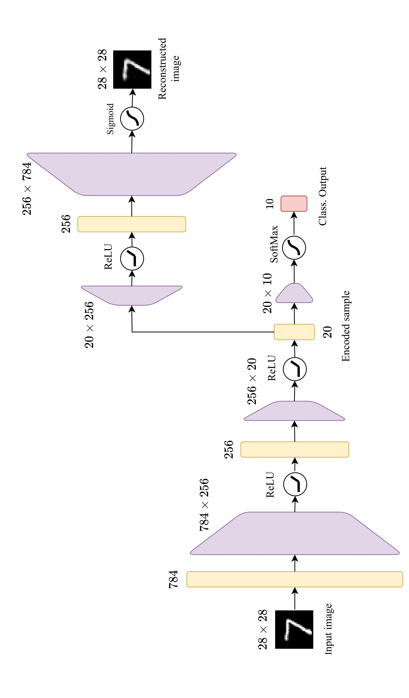
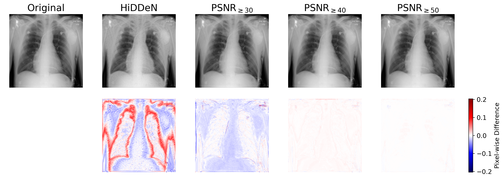

# ConstrainedLearning
Implementation of a Sequential Penalty Method for Training Neural Networks with Explicit Constraints presented in 

[TODO TODO](https://arxiv.org/)

The algorithmic framework handles training problems with per-sample constraints

$$\min_{w} \mathcal{L}(w) = \sum_{i=1}^{N}\ell(w;x^i,y^i)\quad\text{s.t. }c(w;x^i)\le B\quad \forall i,$$

using a sequential penalty approach.

The two experiments reported in the paper are available to run:
- Classification task on [MNIST](https://en.wikipedia.org/wiki/MNIST_database) using a multi-layer perceptron, where we impose that the hidden representation can be used to reconstruct the original image in a trainable decoder-like branch of our network
<p align="center">
  
</p>

- Medical image watermarking employing [HiDDeN](https://arxiv.org/abs/1807.09937) on [ChestX-ray8](https://arxiv.org/abs/1705.02315) dataset, imposing an explicit penalty constraint based on Peak Signal-to-Noise Ratio (PSNR) to preserve the perceptual quality of the watermarked image.
<p align="center">
  
</p>

## Installation
The employment of a [conda](https://docs.conda.io/projects/conda/en/latest/index.html) environment is suggested, running `Python 3.13`. The required dependencies can be installed with
```
pip install torch torchvision
pip install pyiqa
pip install seaborn
pip install pandas
```
We provide the implementation of the experiments reported in the paper.

## Running the MNIST experiment
To run the classification task on MNIST with the additional constraint on the reconstructed image, execute the following
```
python MNIST_EncorderDecoder/main.py [options]
```

The following arguments shall be specified:

<div align='center'>
  
| Short Option  | Long Option           | Type    | Description                                          | Default          |
|---------------|-----------------------|---------|------------------------------------------------------|------------------|
| `-e`          | `--experiment`     | `str`   | Training algorithm to be used                     | None (required)  |
| `-wmp`          | `--warm_model_path`         | `str`   | Path of the base warm model                        | 'warm_models' (If the path does not exist the warm model is trained from scratch and saved)  |
| `-o`         | `--out_dir`          | `str`   | Path to save the output logs                         | None (required)  |
| `-pf`      | `--penalty_fixed`             | `float` | Penalty for the fixed regularization method       | `1.`             |
| `-pb`       | `--penalty_base`              | `float` | Initial penalty for the sequential penalty method                                | `100.`           |
| `-pg`         | `--penalty_grow`         | `float`   | Growing factor for the sequential penalty method                            | `1.01`            |

</div>

Other parameters are specified in `MNIST_EncorderDecoder/main.py` and can be easily adjusted. 

It is possible to run the experiments reported in the paper with:
```
python -u MNIST_EncorderDecoder/main.py -e plain -o out_dir
python -u MNIST_EncorderDecoder/main.py -e fixed -pf 100 -o out_dir
python -u MNIST_EncorderDecoder/main.py -e penalty -pb 100 -pg 1.01 -o out_dir
```

In order to get the final plots/tables `MNIST_EncorderDecoder/make_plots/plot.py` can be used.


## Running the HiDDeN experiment on ChestX-ray8 dataset
To run the training of [HiDDeN](https://arxiv.org/abs/1807.09937) on [ChestX-ray8](https://arxiv.org/abs/1705.02315) dataset, imposing that the difference between the watermarked image and the cover image is below a threshold on the PSNR, execute the following
```
python HiDDeN/main.py new [options]
```

The following arguments shall be specified:

<div align='center'>
  
| Short Option  | Long Option           | Type    | Description                                          | Default          |
|---------------|-----------------------|---------|------------------------------------------------------|------------------|
| `-d`          | `--data-dir`     | `str`   | Path of the dataset | None (required)  | 
| `-m`          | `--message`      | `int`   | Length in bits of the watermark  |`200.`   |
| `None`         | `--penalty`     | (`float` `float` `float`)   | Specifies the penalty coefficients (`start` `increase_factor` `ever_n_epochs`)        | None  |
| `None`      | `--PSNR`             | `float` | Penalty threshold on the PSNR       | None   |
</div>

To continue an interrupted run, execute the following 
```
python HiDDeN/main.py continue [options]
```

Other parameters are specified in `HiDDeN/main.py`. 

To run the experiments reported in the paper, execute:
```
# baseline model
python HiDDeN/main.py new -d DATASET_PATH -e 200 --name hidden -m 200

# sequential penalty trained models
python HiDDeN/main.py new -d DATASET_PATH --penalty 0.1 1.1 10 --PSNR 30 -e 200 -m 200
python HiDDeN/main.py new -d DATASET_PATH --penalty 0.1 1.1 10 --PSNR 40 -e 200 -m 200
python HiDDeN/main.py new -d DATASET_PATH --penalty 0.1 1.1 10 --PSNR 50 -e 200 -m 200
```

It is possible to use the functions in `HiDDeN/make_plots` to obtain the plots reported in the paper and to train and test the classifier that is used with the watermarked images.


## Credits
In case you employed our code for research purposes, please cite:

```
@misc{TODO,
      TODO
}
